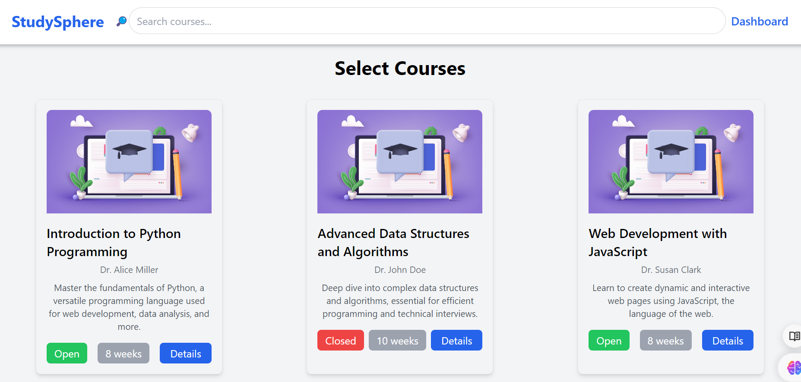
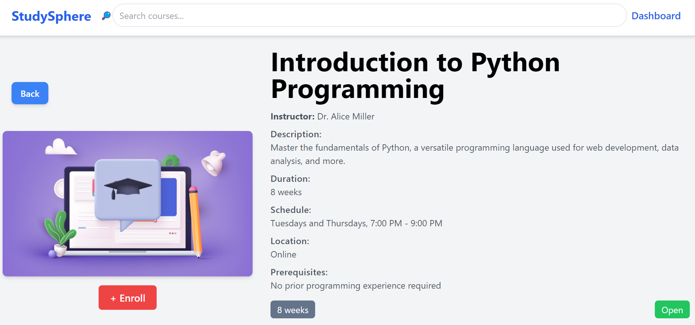
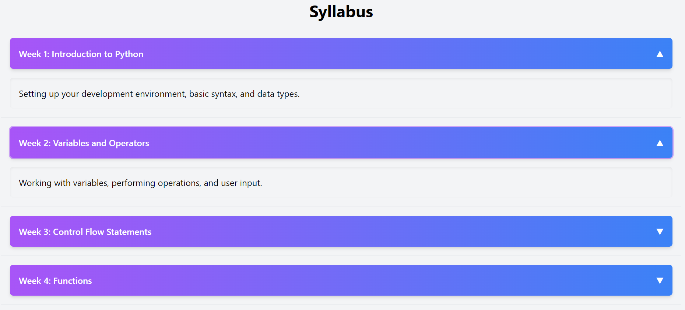

<h1 align="center"> Study Sphere </h1>

### Live Link:
    https://shhiivvaam.github.io/StudySphere/

### OBJECTIVE :

Web Application designed to assist students in discovering and enrolling in courses. It includes a Course Listing page with filters, a detailed Course Details screen, and a Student Dashboard for tracking enrolled courses.



### FEATURES LIST :

1. Course Listing Page
2. Course Details Page
3. Student Dashboard
4. Progress Bar
5. Enrollment Status

# Run Scripts

```Terminal
git clone https://github.com/shhiivvaam/StudySphere.git

cd StudySphere
npm install
npm start
```

# Application Screenshots






